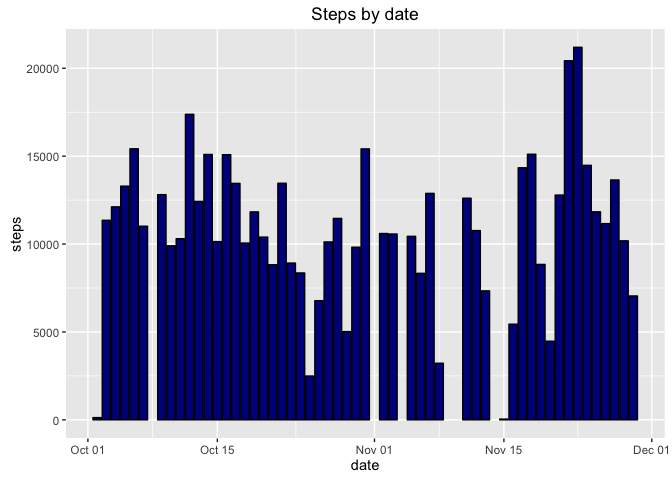
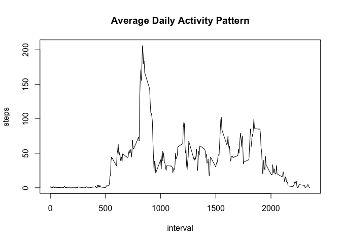
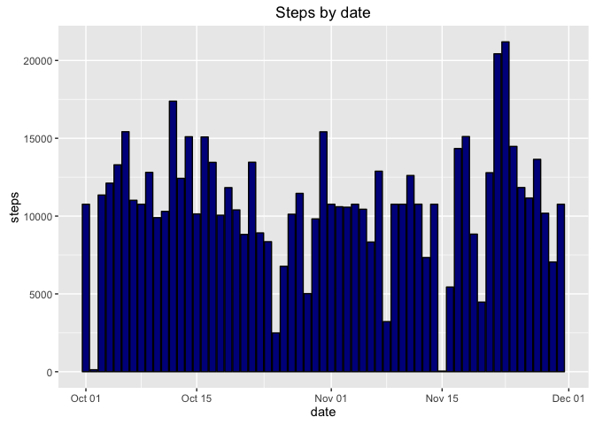
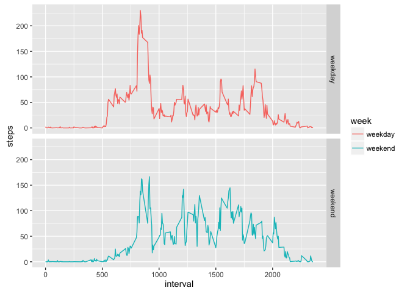

# Reproducible Research: Peer Assessment 1


## Loading and preprocessing the data

```r
    data<-read.csv("activity.csv", sep = ",")
    data$date = as.Date(as.character(data$date), "%Y-%m-%d")
```


## What is mean total number of steps taken per day?

```r
    library(ggplot2)
    library(scales)
    ##removing missing values
    x<-na.omit(data)
    steps_day<-aggregate(steps~date,x,sum)
    ggplot(steps_day, aes(x = date, y = steps))+
        geom_bar(stat = "identity", col = "black", fill = "darkblue")+
        labs(title = "Steps by date", xlab = "Date", ylab = "Steps")
```

<!-- -->

The average of the total number of steps taken per day is:

```r
    round(mean(steps_day$steps))
```

```
## [1] 10766
```

The median of the total number of steps taken per day is:

```r
    round(median(steps_day$steps))
```

```
## [1] 10765
```


## What is the average daily activity pattern?

```r
    steps_interval<-aggregate(steps~interval,x,mean)
    plot(steps_interval$interval,steps_interval$steps, type = "l", xlab = "interval", ylab = "steps")
    title("Average Daily Activity Pattern")
```

<!-- -->

The maximum number of steps is:

```r
    steps_interval$interval[which.max(steps_interval$steps)]
```

```
## [1] 835
```


## Imputing missing values
The total number of missing values in the dataset is:

```r
    sum(is.na(data))    
```

```
## [1] 2304
```

Compliting missing values in dataset

```r
    #only column steps had missing values
    dataComplete<-data
    count<-0
    for (i in 1:nrow(data)){
        if (is.na(data$steps[i])){
            mean_value<-steps_interval[steps_interval$interval==data$interval[i],]
            dataComplete[i,1]<-round(mean_value$steps)
            count<-count+1
        }
    }
```

Make a histogram of the total number of steps taken each day and Calculate and report the **mean** and **median** total number of steps taken per day.


```r
    steps_day_complete<-aggregate(steps~date,dataComplete,sum)
    ggplot(steps_day_complete, aes(x = date, y = steps))+
        geom_bar(stat = "identity", col = "black", fill = "darkblue")+
        labs(title = "Steps by date", xlab = "Date", ylab = "Steps")
```

<!-- -->

The average of the total number of steps taken per day is:

```r
    round(mean(steps_day_complete$steps))
```

```
## [1] 10766
```

The median of the total number of steps taken per day is:

```r
    round(median(steps_day_complete$steps))
```

```
## [1] 10762
```

Do these values differ from the estimates from the first part of the assignment? What is the impact of imputing missing data on the estimates of the total daily number of steps?

The **mean** value from the filled dataset is the same as the value before. 

The **media** value shows a little difference.


## Are there differences in activity patterns between weekdays and weekends?

Create a new factor variable in the dataset with two levels -- "weekday" and "weekend" indicating whether a given date is a weekday or weekend day.


```r
    dataWeek<-dataComplete
    count<-0
    for (i in 1:nrow(dataWeek)){
        if (weekdays(dataWeek$date[i])=="Saturday"){
            dataWeek$week[i]<-"weekend"
            count<-count+1
        }else{
            if (weekdays(dataWeek$date[i])=="Sunday"){
                dataWeek$week[i]<-"weekend"
            }else{
                dataWeek$week[i]<-"weekday"
            }
        }
    }
```

Make a panel plot containing a time series plot (i.e. `type = "l"`) of the 5-minute interval (x-axis) and the average number of steps taken, averaged across all weekday days or weekend days (y-axis). The plot should look something like the following, which was created using **simulated data**:


```r
    dataWeek<-transform(dataWeek, week = factor(week))
    steps_interval_dataWeek<-aggregate(steps~interval+week,data = dataWeek, mean)
    qplot(interval,steps, data = steps_interval_dataWeek, geom = "line", facets = week~., color = week)
```

<!-- -->

The plot shows a difference with a higher peak of activity during weekdays, compared to weekends, which have greater mean activity overall.

